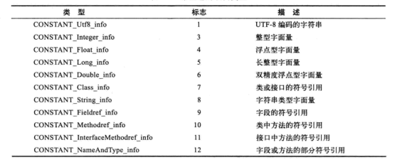
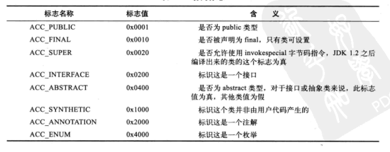
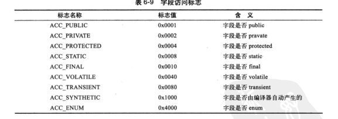
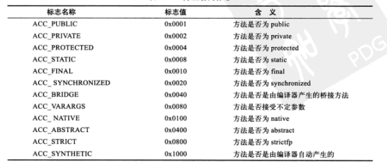

# Class文件

数据在class文件里以大端方式存储

辅助工具 classpy 

```go

ClassFile{
	u4 magic;     // 4个字节 32bit
	u2 minor_version;   // 2个字节 16bit
	u2 major_version;  // 2个字节 16bit
	u2 constant_pool_count;   //2个字节 16bit
	cp_info constant_pool[constant_pool_count-1];
	u2 access_flags; 
	u2 this_class;
	u2 super_class;
	u2 interfaces_count;
	u2 interfaces[interfaces_count];
	u2 fields_count;
	field_info fields[fields_count];
	u2 methods_count;
	method_info methods[methods_count];
	u2 attributes_count;
	attribute_info attributes[attributes_count];
}

```


### magic魔数

0xCAFEBABE (cafe babe)

### 常量池项目类型



### 访问标志



### 字段信息（field_info）

字段表结构(见代码)

字段访问标志:




### 方法信息 （method_info）


方法访问标志



>方法里的代码在哪？
>方法里的代码实在方法属性表集合中一个名为“Code”的属性里面

### utf-8缩略编码

utf-8缩略编码与普通 utf-8 编码的区别：
 从'\u0001'到'\u007f'之间的字符的缩略编码使用一个字节表示，从'\u0080'到'\u07ff'之间所有字符的缩略编码用两个字节表示，从'\u0800'到'\uffff'之间的所有字符的缩略编码就按照普通utf-8编码规则使用三个字节表示。

将 MUTF-8 转化为 String


### 解析过程

解析是逐一byte进行解析

顺序为

- magic
- minor
- major
- constant pool size
- constant pool
    - CONSTANT_Utf8_info
    - CONSTANT_Integer_info
    - ...
- access_flag
- this_class
- super_class
- interfaces count
- interfaces
    - aa
- field count
- method count
- methods
- attributes count
- attributes
    
### 访问标志

用于识别类或接口层次的信息，包括这个类是Class还是接口；是否为public类型，是否为abstract类型，如果是类是否被声明为final。


#### Go和Java语言基本数据类型对照关系


运行结果

```bash
java.lang.String
version: 52.0
constants count: 548
access flags: 0x31
this class: java/lang/String
super class: java/lang/Object
interfaces: [java/io/Serializable java/lang/Comparable java/lang/CharSequence]
fields count: 5
  value
  hash
  serialVersionUID
  serialPersistentFields
  CASE_INSENSITIVE_ORDER
methods count: 94
  <init>
  <init>
  <init>
  <init>
  <init>
  <init>
  <init>
  checkBounds
  <init>
  <init>
  <init>
  <init>
  <init>
  <init>
  <init>
  <init>
  <init>
  length
  isEmpty
  charAt
  codePointAt
  codePointBefore
  codePointCount
  offsetByCodePoints
  getChars
  getChars
  getBytes
  getBytes
  getBytes
  getBytes
  equals
  contentEquals
  nonSyncContentEquals
  contentEquals
  equalsIgnoreCase
  compareTo
  compareToIgnoreCase
  regionMatches
  regionMatches
  startsWith
  startsWith
  endsWith
  hashCode
  indexOf
  indexOf
  indexOfSupplementary
  lastIndexOf
  lastIndexOf
  lastIndexOfSupplementary
  indexOf
  indexOf
  indexOf
  indexOf
  lastIndexOf
  lastIndexOf
  lastIndexOf
  lastIndexOf
  substring
  substring
  subSequence
  concat
  replace
  matches
  contains
  replaceFirst
  replaceAll
  replace
  split
  split
  join
  join
  toLowerCase
  toLowerCase
  toUpperCase
  toUpperCase
  trim
  toString
  toCharArray
  format
  format
  valueOf
  valueOf
  valueOf
  copyValueOf
  copyValueOf
  valueOf
  valueOf
  valueOf
  valueOf
  valueOf
  valueOf
  intern
  compareTo
  <clinit>

```

